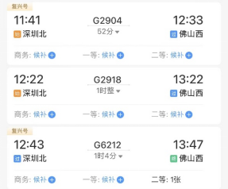
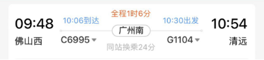
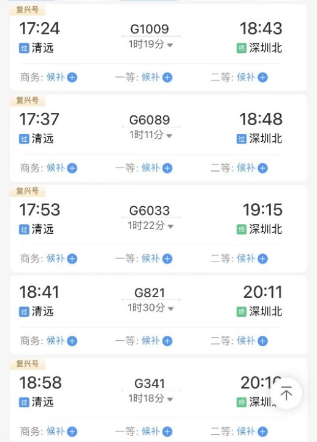

# 国庆出游安排

| 日期  | 住宿  |  主线任务  |      主要行程      |   空余时间   |
| :---: | :---: | :--------: | :----------------: | :----------: |
| 10.1  | 佛山  |   音乐节   |    深圳北佛山西    |      无      |
| 10.2  | 深圳  | 古龙峡漂流 |  佛山西广州南清远  |      无      |
| 10.3  | 深圳  |  gap一天   |   深圳city walk    |   满满一天   |
| 10.4  | 深圳  | 凌晨去爬山 |       梧桐山       |  下午至晚上  |
| 10.5  | 深圳  |  洗浴中心  | 去往洗浴中心的路上 | 看洗浴时间喽 |
| 10.6  | 深圳  | Last dance |   深圳city walk    |   满满一天   |

行李物品：

①佛山音乐节
水，纸巾，湿巾，黄瓜？充气沙发，零食

②古龙峡漂流
换洗衣物，手机防水袋，眼镜绑绳，涉水鞋，简单的洗漱用品（沐浴露，毛巾等）

③爬山
水，零食，手电筒，手机收纳袋，雨伞，长裤，双飞人，纸巾，湿巾，扇子

餐馆：

印度菜，潮汕牛肉火锅，螺蛳粉,荔枝烤肉，小龙虾，大排档

## 10.1（音乐节）
西安 → 深圳。  
飞机09:50到深圳宝安机场。  
地铁（57分钟） 11号线，5号线。  
11：30左右到达深圳北站。  
高铁（深圳北站 → 佛山西站）。  
中间需要去一趟酒店收拾一下，预计可能3点左右入场。  

晚上住在佛山。  
酒店：贡盈酒店（佛山西站店）。  
距离时间：  
（佛山西站 → 酒店）打车7分钟。  
（酒店 → 佛山青年公园）打车20分钟。

## 10.2（古龙峡漂流）
打车（酒店 → 佛山西站）7分钟。  
从佛山出发。  
高铁（佛山西站 → 广州南站 → 清远站）。  

上午11点左右到清远。  
吃饭，然后准备漂流事宜。  
漂流结束大概4点左右？最晚不能超过5点（包括洗澡和收拾行李的时间，最晚要在5:30出发）。  
打车（古龙峡漂流 → 清远站）50分钟左右。  

古龙峡漂流入场二维码：

## 10.3（gap）

gap一天，随意支配。  
晚上需要先休息一下，可以下午7点多回酒店。可能需要晚上11点多就出门。  
只能打车（或者更早出门）（酒店 → 梧桐山 1小时左右）。  

## 10.4（爬梧桐山）

夜（指凌晨）爬梧桐山。  
凌晨1点左右开始。  
夜爬需要走小路，上山3-4小时。  
下山3-4小时，可能在中午之前回到酒店。  
休息。  

## 10.5（洗浴中心）

## 10.6

